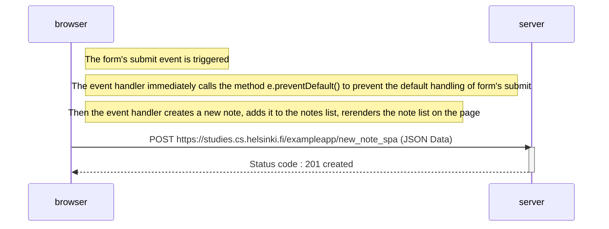

```mermaid
sequenceDiagram
    participant browser
    participant server
    Note right of browser: The form's submit event is triggered
    Note right of browser: The event handler immediately calls the method e.preventDefault() to prevent the default handling of form's submit
    Note right of browser: Then the event handler creates a new note, adds it to the notes list, rerenders the note list on the page

    browser->> server: POST https://studies.cs.helsinki.fi/exampleapp/new_note_spa  (JSON Data)

    activate server
     server-->>browser: Status code : 201 created
    deactivate server

```